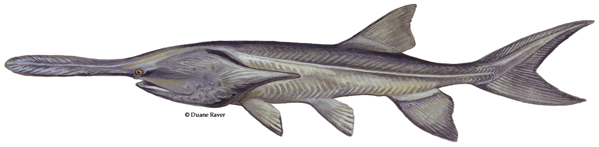

# Paddlefish

Distribution: 
Paddlefish are one of the most unique fish in Oklahoma. They can live up to 50 years and range throughout the U.S. from Montana to Louisiana. In Oklahoma, they are found mainly in the Grand Neosho, Arkansas and Red River systems.
The paddlefish was alive when dinosaurs were rumbling around in the late Cretaceous Period.  Paddlefish are one of the most unique fish in Oklahoma.  Paddlefish have long oar or spoon like bills and don’t look like any other Oklahoma fish.  They also have smooth scaleless skin and broad shark like tails.  During the spring, males develop sandpapery like bumps (breeding tubercles) on their heads and back.  Paddlefish have wide gaping mouths and toothbrush like bristles in their gills. They swim through the water with their mouth open and filter feed on small microscopic plankton, much like whale sharks do. 

Habitat: 
American paddlefish are well adapted to living in rivers and lakes. They inhabit many types of habitats and occur most frequently in deeper, low current areas such as side channels, backwater lakes and tailwaters below dams. 

Natural Food Sources: 
One of Oklahoma’s largest fish, the paddlefish feeds on tiny zooplankton (microscopic insects).

Spawning: 
Male paddlefish are old enough to spawn when they are four to nine years. Females spawn when they are 6-12 years old. Spawning season is from March through June, when spring rains raise the water levels of rivers and water temperatures reach 50-60 degrees. Males and females gather in schools and release their eggs over gravel or sandbars. This is called "broadcast spawning." 

Facts: 
Paddlefish are caught by snagging, usually beginning sometime in March and ending in late April, during their early spring spawning run. This prehistoric fish can be caught by snagging with a stout surf rod, heavy test line, and a large, barbless treble hook.
Paddlefish were once very abundant throughout their range, but have declined in numbers. Threats to paddlefish include:
Construction of dams which have affected breeding and feeding patterns
Fish kills and water quality issues associated with dam operations
Illegal harvest of adult paddlefish for caviar
In 1992, fisheries biologists began an effort to re-introduce paddlefish to waters where they has become locally eradicated. Dams on several rivers had blocked the annual movements of paddlefish in several river systems. Hatchery professionals raised young paddlefish in Byron and Tishomingo and then released them in Kaw, Oologah, Texoma, and Hugo lakes.
The fisheries division of the wildlife department have placed bands on thousands of paddlefish in lakes statewide. These bands are an important research tool allowing biologists to learn about population abundance, individual growth, and annual harvest. Anglers can assist in this effort by reporting banded harvest, not removing bands from released fish, and knowing the regulations. This research is being paid for through the federally-administered State Wildlife Grant.

